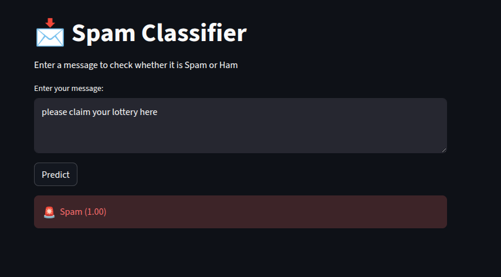
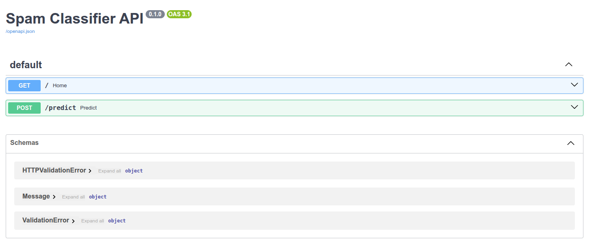
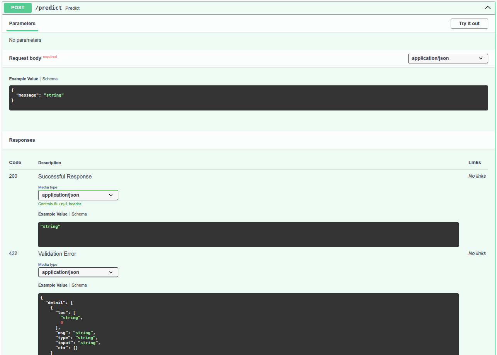
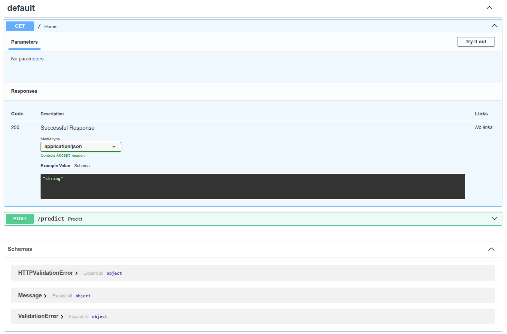

# 📩 Spam Classifier (Email/SMS)


A complete end-to-end machine learning project that classifies messages as **Spam** or **Ham (Not Spam)**.
This project covers everything from data preprocessing and model building to API development, frontend integration, and cloud deployment.

---

## 🚀 Project Overview

The goal of this project is to build a reliable spam detection system using real-world SMS data.
The system takes a text message as input and returns:

* Predicted label (Spam / Ham)
* Confidence score (probability)

The project is designed to reflect a **real production workflow**, not just a notebook-based model.

---

## ✨ Features

* Text classification using Machine Learning
* Clean preprocessing pipeline (reusable in API)
* Multiple models trained and compared
* REST API built with FastAPI
* Interactive frontend using Streamlit
* Deployed and accessible online

---

## 🧠 Machine Learning Approach

### Dataset

* SMS Spam Collection Dataset (~5,500 messages)
* Binary classification: spam vs ham

### Preprocessing

* Lowercasing text
* Removing special characters and numbers
* Stopword removal (NLTK)
* Stemming (Porter Stemmer)

### Feature Engineering

* Bag of Words (CountVectorizer)
* TF-IDF (used for final model)

### Models Trained

* Naive Bayes
* Logistic Regression
* Support Vector Machine (SVM)

### Model Selection

SVM was selected based on the best balance of precision and recall (highest F1-score).

---

## 📊 Model Performance

| Model               | Accuracy | Precision | Recall | F1 Score |
| ------------------- | -------- | --------- | ------ | -------- |
| SVM                 | 0.98     | 1.00      | 0.87   | **0.93** |
| Naive Bayes         | 0.97     | 0.99      | 0.85   | 0.91     |
| Logistic Regression | 0.97     | 1.00      | 0.79   | 0.88     |

**Note:**
Precision is especially important in spam detection to avoid marking legitimate messages as spam.

---

## 🏗️ Project Structure

```
Spam-Classifier/
│
├── data/                # Raw and processed data
├── notebooks/           # EDA and experimentation
├── src/
│   └── preprocess.py    # Text preprocessing logic
│
├── model/
│   ├── spam_model.pkl
│   └── tfidf_vectorizer.pkl
│
├── app/
│   ├── main.py          # FastAPI backend
│   └── streamlit_app.py # Frontend UI
│
├── requirements.txt
├── runtime.txt
└── README.md
```

---

## ⚙️ Tech Stack

* Python
* Scikit-learn
* NLTK
* FastAPI
* Streamlit
* Uvicorn

---

## 🌐 Live Demo

* Frontend: *[Streamlit link](https://spam-classifier-a4i5b83fnzxtpe8nwsqefy.streamlit.app/)*
* API Docs: *[Render `/docs` ](https://spam-classifier-ps0y.onrender.com/docs)*

## 🏗️ System Architecture

Streamlit UI → FastAPI Backend → ML Model (SVM + TF-IDF)


## 📸 Screenshots

### 🔹 Streamlit UI


*User interface showing spam prediction with probability score*

---

### 🔹 API Overview (Swagger Docs)


*FastAPI interactive documentation interface*

---

### 🔹 Predict Endpoint


*POST /predict endpoint for spam classification*

---

### 🔹 API Request Example


*Example request body and response structure*


---

## 🧪 API Example

### Endpoint

```
POST /predict
```

### Request

```json
{
  "message": "Congratulations! You won a free iPhone"
}
```

### Response

```json
{
  "prediction": "Spam",
  "probability": 0.97
}
```

---

## 💻 Running Locally

### 1. Clone the repository

```bash
git clone https://github.com/vansh-kumar-007/Spam-Classifier
cd spam-classifier
```

### 2. Install dependencies

```bash
pip install -r requirements.txt
```

### 3. Run the API

```bash
uvicorn app.main:app --reload
```

### 4. Run the frontend

```bash
streamlit run app/streamlit_app.py
```

---

## 📌 Key Learnings

* Importance of consistent preprocessing between training and deployment
* Trade-off between precision and recall in classification problems
* Building and structuring ML projects beyond notebooks
* Integrating ML models with APIs and frontends
* Deploying full-stack ML applications

---

## 🔮 Future Improvements

* Use deep learning models (LSTM / BERT)
* Improve UI/UX of frontend
* Add logging and monitoring
* Containerization using Docker
* Store prediction history

---

## 👨‍💻 Author

**Vansh Kumar**

* GitHub: https://github.com/vansh-kumar-007
* LinkedIn: https://www.linkedin.com/in/vanshkumar007/

---
